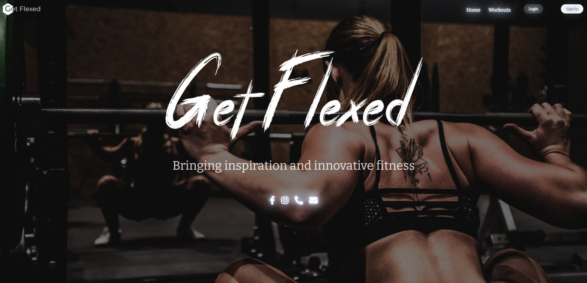
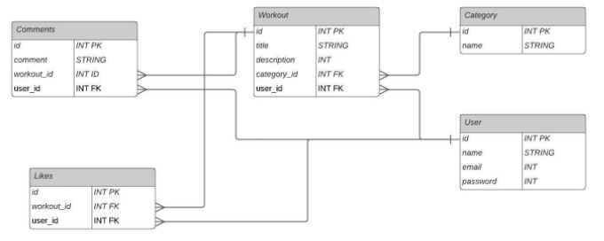

# **Table of Contents**
[Description](#description) | 
[Technologies](#technologies) | 
[Links](#links) |
[Install](#install) |
[Usage](#usage) |
[Contact](#contact) |
[License](#license)

## **Description**
This app was developed as a sage place workout social platform. This is done through a database of workouts that are displayed on the homepage toegther. Here users are able to sort by cateogry to fit their needs and create a workout plan that is accessible to them. It allows the user to create an account. This will alow them to create a workout and add a category. When created the workout then will allow users to comment on it to share their thoughts and inspirations, or they can favorite a workout which allows them to save it for later and come back to it whenever they want.

### **Features**
* Post and share your workouts for others to see
* Get inspired by your workout news feed
* Set favorites to your collection for later
* Get encouraged and support others through the comments feature

This app was developed using the MVC model. It uses mySQL and Sequelize to create the models. The control is built using NodeJS and Express packages. And views are created using Handlebars, HTML, CSS, and Javascript. Authentication for the site uses express-session and bcrypt, this allows us to keep track of user sessions when they log into the app as well as allows a way for us to hash their passwords for the site.

## **Technologies**

    
    
    
    
    
    

### NPM Packages
#### Dependencies

    
    
    
    
    

    
    
    

#### Dev Dependencies

    
    

## **Links** 
This [Demo Video](https://youtu.be/O_QxmIW4zg8) will walk you through the application and its usage.

    

### Database Flow  

## **Install**

Please use **'npm i'** in the command line to install the dependencies.

Before you begin please also update the **'.env.EXAMPLE'** file to include your information for SQL. Then rename the file to **'.env'**. Without the app will not be able to access the database properly.

Please then use in the MySQL terminal **'source db/schema.sql;'**, this will create the database.

Also in the powershell terminal use **'npm run seed'**, this will seed the database with data.

## **Usage**
When ready use **'npm start'** into the terminal to launch the app.

## **Contact**
If you want to see more of our work please checkout our GitHub profiles
 
[Sheyla Popovich](https://github.com/SheylaPopovich) | [Lassette Brown](https://github.com/LasetteBrown) | [Niklas Ertle](https://github.com/niklasertle)

Or you can email us here
 
[Sheyla Popovich](mailto:sheylapopovich@gmail.com) | [Lassette Brown](mailto:lassette.brown@gmail.com) | [Niklas Ertle](mailto:nik.ertle16@gmail.com)

## **License**
[MIT License Copyright (c) 2021 Lassette Brown](LICENSE)